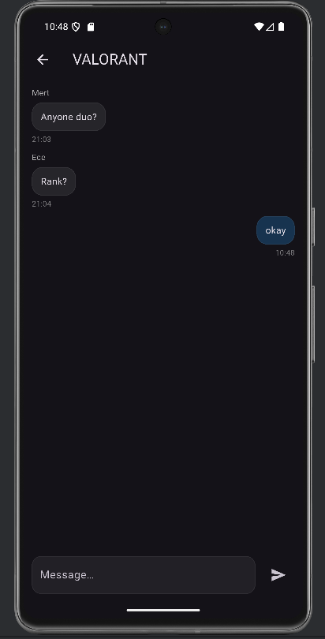
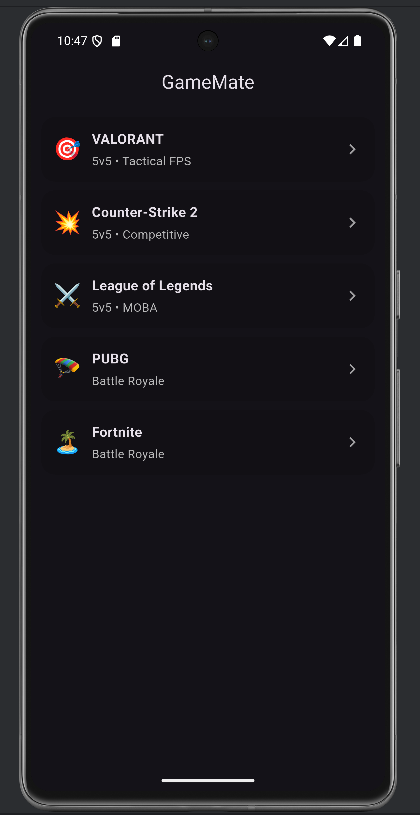

# GameMate 🎮

GameMate is a Flutter-based mobile application that helps gamers find teammates through real-time, game-specific chat rooms.

## 📸 Screenshots

  
  

---

## ✨ Features
- Username-based sign-in flow
- Modern onboarding experience
- Browse popular multiplayer games
- Real-time, game-based chat rooms
- Firebase Authentication
- Firebase Firestore for real-time messaging
- Message validation and anti-spam throttling
- Secure Firestore rules
- Auto-scroll and polished dark UI

---

## 🧱 Architecture
- Flutter (Material 3)
- Repository pattern
- Firebase Auth & Firestore
- Clean separation of concerns:
    - `models` → data structures
    - `services` → repositories & sessions
    - `screens` → UI layers

---

## 🚀 Project Status
**MVP completed – store-ready prototype**

This project was built as a portfolio-grade application to demonstrate:
- real-time systems
- secure backend integration
- clean UI/UX practices
- production-oriented thinking

---

## 🛠 Tech Stack
- Flutter & Dart
- Firebase Authentication
- Firebase Firestore
- Android & iOS support

---

## 👤 Author
**Umut Kunic**  
Computer Engineering Student  
Pamukkale University
